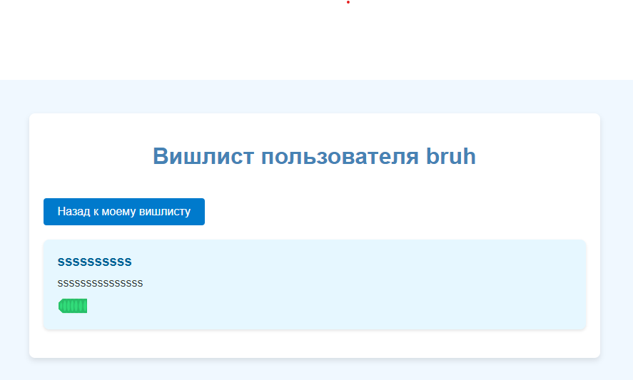

# Проект wish list
## Описание проекта:
Зарегистрированные пользователи могут составлять вишлисты (списки желаний), чтобы другие люди могли перейти по их ссылке и определиться с тем, что подарить человеку. Есть интерфейс для добавления нового желания в список и для вывода всех желаний.
### Регистрация:

### Логин:

### Мой виш лист:

### публичный виш лист:

### добавить желание:

## Основные возможности проекта:
### Регистрация и авторизация пользователей:

- форма регистрации нового пользователя (имя, email, пароль);
- форма авторизации зарегистрированного пользователя (email, пароль).

### Интерфейс для создания нового вишлиста:

- добавление и удаление желаний в вишлисте;
- возможность добавления описания, ссылки и изображения для каждого желания;
- просмотр всех желаний в вишлисте;
- общий доступ к вишлисту.